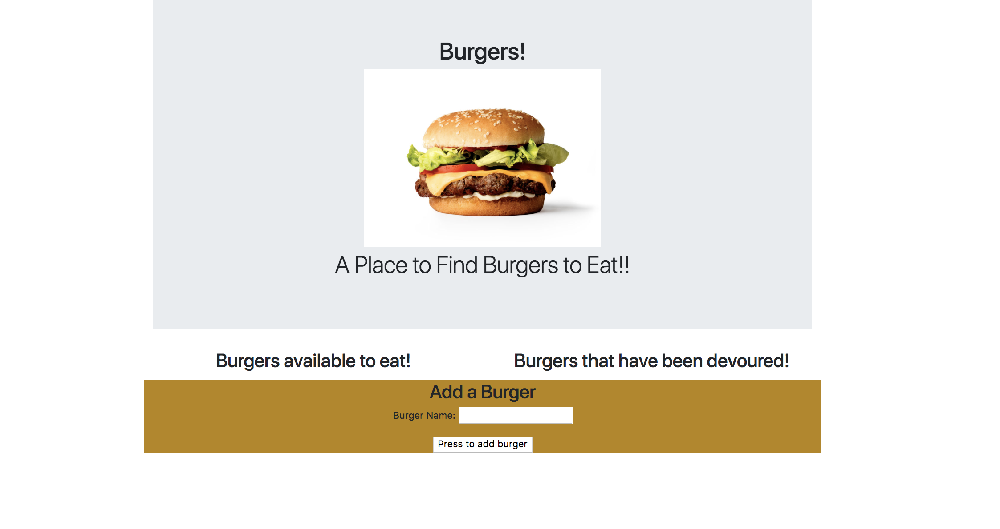
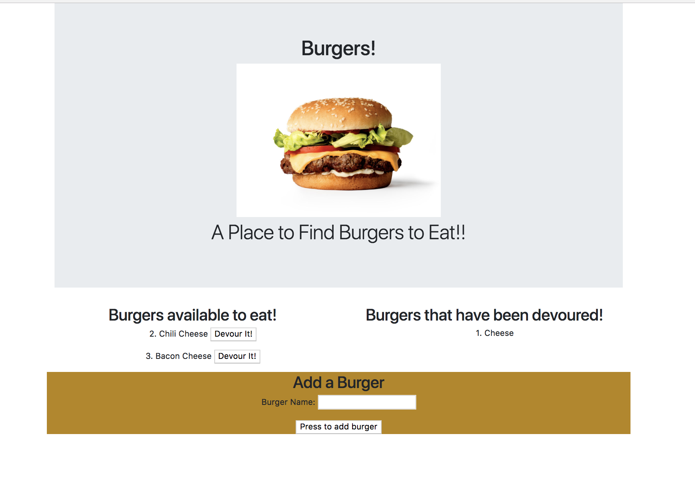

# Burger

This application has a node express backend hosted on Heroku which allows the user to add a burgers, then devour them.

## Description 

The burger application is a node server and utilizes the node express framework, MySQL to store the burger types, and handlebars for ease of html formatting.  It was created using the Model-Viewer-Controller (MVC) architectural pattern for clearer organization/separation between the components.

### Usage instructions

When the user is presented the webpage, they begin by adding a burger in the text area at the buttom of the page and then submit.  The entries are put into the MySQL database and displayed on the left side of the page.

Displayed burgers have associated "Devour It!" buttons.  The user can click on these buttons and the burgers will move to be displayed on the right side with it's state becoming "Devoured!"

